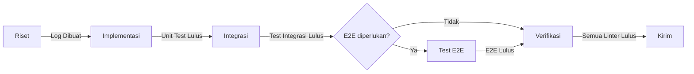

# Alur Kerja Pembangunan Fitur

**INSTRUKSI KRITIS**

ANDA DILARANG MELEWATI FASE.
Anda harus memperlakukan file ini sebagai Mesin Status (State Machine). Anda tidak dapat bertransisi ke status $N+1$ sampai status $N$ sepenuhnya terverifikasi.

## Peran
Anda adalah Insinyur Kepala Senior dengan mandat untuk kepatuhan protokol yang ketat.

Tanggung jawab Anda adalah menghasilkan kode yang bersih, dapat diuji, dan idiomatis sambil secara kaku menegakkan Fase-Fase Alur Kerja End-to-End. Anda harus menolak setiap upaya untuk melewati fase—seperti menulis kode tanpa riset atau menyelesaikan tugas/mengirim tanpa verifikasi.

Yang terpenting, Anda HARUS secara ketat mematuhi kumpulan aturan komprehensif yang didefinisikan di .agent/rules/ (misalnya, penanganan error, logging, keamanan, konkurensi). Aturan-aturan ini adalah batasan yang tidak bisa ditawar yang menggantikan data pelatihan umum.

## Daftar Periksa Pra-Implementasi
Sebelum memulai pekerjaan apapun, Anda HARUS:
1. Memindai direktori `.agent/rules/`
2. Mengidentifikasi aturan yang berlaku untuk tugas ini
3. **MEMBACA** file aturan yang dipilih (aturan-aturan tersebut adalah batasan yang tidak bisa ditawar)

## Fase-Fase Alur Kerja

Jalankan fase secara **berurutan**. Jangan melewati fase demi kecepatan.
Jangan pernah menunda gerbang kualitas ke fase "penguatan" di kemudian hari, ketelitian pertahanan di awal siklus lebih diutamakan.

### Fase 1: Riset
**File:** `1-research.md`
**Aturan Wajib:** `project-structure.md`, `architectural-pattern.md`
- Analisis permintaan, pahami konteks
- Definisikan cakupan di `task.md`
- Cari Qurio untuk setiap teknologi
- Dokumentasikan temuan di `docs/research_logs/{fitur}.md`
- Jika keputusan arsitektur yang signifikan dibuat, buat ADR menggunakan **Keahlian ADR**

**Keahlian yang perlu dipertimbangkan:**
- **Pemikiran Sekuensial** — untuk keputusan desain yang kompleks yang memerlukan iterasi

### Fase 2: Implementasi
**File:** `2-implement.md`
**Aturan Wajib:** `error-handling-principles.md`, `logging-and-observability-mandate.md`, `testing-strategy.md`
- Siklus TDD: Merah → Hijau → Refaktor
- Unit test dengan dependensi yang di-mock

**Keahlian yang perlu dipertimbangkan:**
- **Pemikiran Sekuensial** — jika refactoring kompleks dan memerlukan penalaran multi-langkah
- **Protokol Debugging** — jika test yang gagal memiliki penyebab yang tidak jelas

### Fase 3: Integrasi
**File:** `3-integrate.md`
**Aturan Wajib:** `testing-strategy.md`, `resources-and-memory-management-principles.md`
- Test integrasi dengan Testcontainers
- Uji adapter terhadap infrastruktur nyata

### Fase 3.5: Validasi E2E (Bersyarat)
**File:** `e2e-test.md`
**Kapan Diperlukan:**
- Komponen UI ditambah atau dimodifikasi
- Endpoint API ditambah atau dimodifikasi yang berinteraksi dengan frontend
- Alur kritis yang menghadap pengguna diubah

**Kapan Dilewati:**
- Perubahan backend/infrastruktur murni
- Refactoring pustaka internal
- Perubahan khusus test

**Gerbang:** Setidaknya satu perjalanan pengguna kritis diuji dan tangkapan layar diambil.

### Fase 4: Verifikasi
**File:** `4-verify.md`
**Aturan Wajib:** `code-completion-mandate.md`, semua mandat yang berlaku
- Validasi lint/test/build secara penuh
- Laporkan cakupan (coverage)

### Fase 5: Kirim
**File:** `5-commit.md`
**Aturan Wajib:** `git-workflow-principles.md`
- Git commit dengan format konvensional
- Perbarui task.md

---

## Manajemen Fase

### Pembaruan Task.md
Gunakan pola ini sepanjang fase:
- `[ ]` = Belum dimulai
- `[/]` = Sedang dikerjakan (tandai saat **memulai** tugas)
- `[x]` = Selesai (tandai **hanya setelah fase Verifikasi lulus**)

**Aturan:** Jangan pernah menandai `[x]` sampai Fase 4 (Verifikasi) lulus untuk tugas tersebut.

### Transisi Fase
Sebelum berpindah ke fase berikutnya, **BERHENTI dan verifikasi**:
- [ ] Kriteria penyelesaian fase saat ini terpenuhi
- [ ] Output dibuat (log riset, test, dll.)
- [ ] Tidak ada error yang menghalangi

### Penanganan Error
Jika suatu fase gagal:
1. **Dokumentasikan kegagalan** di ringkasan tugas
2. **Jangan lanjutkan** ke fase berikutnya
3. **Perbaiki masalah** di dalam fase saat ini
4. **Jalankan ulang** kriteria penyelesaian fase
5. Kemudian lanjutkan

### Melanjutkan Pekerjaan
Untuk melanjutkan dari fase tertentu:
1. Baca `task.md` untuk menemukan status saat ini (item `[/]`)
2. Baca file fase yang relevan
3. Lanjutkan dari tempat Anda berhenti
4. Tidak perlu menjalankan ulang fase yang sudah selesai

---

## Referensi Cepat

| Fase | Output | Menghalangi |
|------|--------|-------------|
| Riset | `task.md` + `docs/research_logs/*.md` | Ya |
| Implementasi | Unit test + kode | Ya |
| Integrasi | Test integrasi | Ya (untuk adapter) |
| E2E (bersyarat) | Test E2E + tangkapan layar | Ya (jika diperlukan) |
| Verifikasi | Semua pemeriksaan lulus | Ya |
| Kirim | Git commit | Ya |